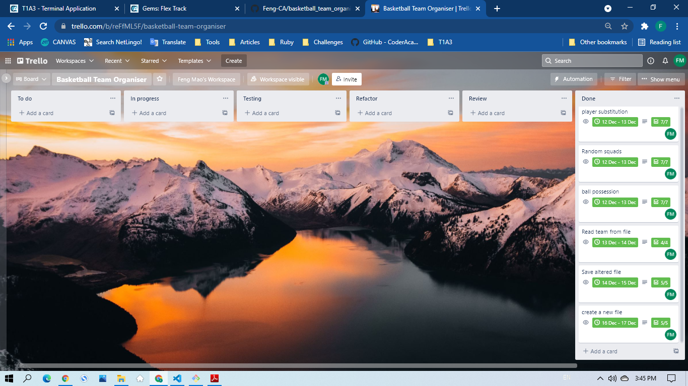

# Ruby Basketball Team Organiser

## R3. Provide full attribution to referenced sources (where applicable)

### References
<a id="1">[How to install Linux Bash on Windows 10]</a> 
Prakash, A. (2020, October 29). How to Install Linux Bash Shell on Windows 10. It’s FOSS. https://itsfoss.com/install-bash-on-windows/

<a id="2">[Installing Ruby]</a>
ruby-lang. (n.d.). Installing Ruby. Retrieved December 17, 2021, from https://www.ruby-lang.org/en/documentation/installation/

## R4. Provide a link to your source control repository
This is a link to my source control repository : [Feng-CA/basketball_team_organiser] (https://github.com/Feng-CA/basketball_team_organiser)

## R5. Develop a statement of purpose and scope for your application. It must include:
- describe at a high level what the application will do
- identify the problem it will solve and explain why you are developing it
- identify the target audience
- explain how a member of the target audience will use it

The purpose and scope of the terminal application
- This application can help the management of a basketball team to organise the team players efficiently in an activity day. It enables the fairness and transparency of the training activities. The features of this application can help the team leader to replace existing player with substitution player; to divide evenly the 15 players into 3 squads and select first two squads randomly generated to play on the floor first; to decide which squad on the floor wins the ball possession before the game started or disputes emerged during the game; to create a new file to store another team list.

- The target audience will be the leader of the basketball team. The user can simply run this application and choose one or more options which he want to proceed and follow the instruction prompted. If the user is not sure where to go then can find more information on README documentation.

## R6. Develop a list of features that will be included in the application. It must include:
- at least THREE features
- describe each feature

Note: Ensure that your features above allow you to demonstrate your understanding of the following language elements and concepts:
- use of variables and the concept of variable scope
- loops and conditional control structures
- error handling

Consult with your educator to check your features are sufficient.

### Features
- player substitution
This feature allows the user to use a subsitution player to replace the existing player. Firstly the user can remove the existing player from the team list by applying name validation conditional control and then add the substitution player to the team list by applying another conditioanl control to avoid duplicate name. So this feature can maintain 15 players in the name list for the activity day.

- random squads
The user can randomly divide 15 players into 3 squads to play game. Each squad will have 5 players. These feature can also help user to decide the first and second squad randomly generated will start the game on the floor. The third squad will be the ratation on the bench.

- ball possession
This application uses the coin flip game to decide which squard on the floor wins the ball possession. The winner of the guess will get the ball for his squard. Firstly the user gets two representives respectively from the two squads who will play on the floor. They can only choose one side of the coin either heads or tails. Then the application will randomly choose heads or tails compared to the player's guess. If one player guess is same as the game random result. His squad wins the ball possession on the floor. In addition, the user can use this feature when a dispute emerged during the game.

- save and exit
    - The user has an option to save the substitution player in the name list before exit.

- create a new team list from command line interface
    - The user can also create a new team list from command line interface, add 15 names to the new list by applying conditional control to avoid duplicate name then autosave it to the data folder.

## R7. Develop an outline of the user interaction and experience for the application.
Your outline must include:
- how the user will find out how to interact with / use each feature
- how the user will interact with / use each feature
- how errors will be handled by the application and displayed to the user

- The user can follow the prompt from terminal to choose what he want to do. If the user doesn't know then can find all the informations on the README file.
- The user can choose each feature option according to what result the user want to achive. Then the user can make decision according to the output of options respectively.
- To achive best user experience, all errors from the user's input will be handled internally. Each time of the input error emerges, the terminal will prompt the user to make correct input with hints until the application gets what it need to run.

## R8. Develop a diagram which describes the control flow of your application. Your diagram must:
- show the workflow/logic and/or integration of the features in your application for each feature.
- utilise a recognised format or set of conventions for a control flow diagram, such as UML.

### This applicaion flow chart diagram


## R9. Develop an implementation plan which:
- outlines how each feature will be implemented and a checklist of tasks for each feature
- prioritise the implementation of different features, or checklist items within a feature
- provide a deadline, duration or other time indicator for each feature or checklist/checklist-item

*Utilise a suitable project management platform to track this implementation plan. Your checklists for each feature should have at least 5 items.*

### My inplementation plan - using Trello project management
#### Features - tasks to be done
- Player substitution
    - checklist
        1. create and test a Team class and initializes instance variables (Duration: 0.5 hour)
        2. add and test delete_name method in Team class (Duration: 1 hour)
        3. add and test add_name method in Team class (Duration: 1 hour)
        4. create and test substitution method in Team class (Duration: 0.5 hour)
        5. output upated team list (Duration: 0.5 hour)
        6. apply substitution method in menu system (Duration: 0.5 hour)
        7. Error handling (Duration: 3 hours)

- Random squads
    - checklist
        1. add and test a method in Team class (Duration: 0.5 hour)
        2. create and test an array equal to the shuffled name list (Duration: 0.5 hour)
        3. create another method in Team class (Duration: 1.5 hour)
        4. in above method ensure the shuffled list divide evenly into 3 arrays (Duration: 0.5 hour)
        5. output the 3 random squads (Duration: 0.5 hour)
        6. add squad result method in Team class (Duration: 0.5 hour)
        7. output the result of each squad with name list (Duration: 0.5 hour)
        8. find a way to output which two squads to be selected to play on the floor first (Duration: 0.5 hour)

- Ball possession
    - checklist
        1. create a coin flip method in the Team class (Duration: 0.5 hour)
        2. in this method ensure the person only choose between 0 or 1 (Duration: 0.5 hour)
        3. create an output method in the Team class (Duration: 0.5 hour)
        4. in this method ensure to get a sample result from 0 and 1 in an array (Duration: 0.5 hour)
        5. compare the guess of the player with this sample result (Duration: 0.5 hour)
        6. output the winner of the guess and ball possission (Duration: 0.5 hour)
        7. error handling (Duration: 2 hours)

- Save and exit
    - checklist
        1. create a save methond in the Team class (Duration: 0.5 hour)
        2. in the method ensure the altered name list replaces the origin name list (Duration: 0.5 hour)
        3. in the menu option check whether the name list has been altered (Duration: 0.5 hour)
        4. if yes then implement the save method and exit (Duration: 0.5 hour)
        5. if not then exit with farewell (Duration: 0.5 hour)

- Create a new text file from command line interface
    - checklist
        1. create a method in the Team class
        2. in the method to create a new text file
        3. create a new empty array
        4. add 15 names to the array and ensure no same name repeat
        5. save the new file

#### Screenshot of the Trello project management


## R10. Design help documentation which includes a set of instructions which accurately describe how to use and install the application.

You must include:
- steps to install the application
- any dependencies required by the application to operate
- any system/hardware requirements

### installation guide
1. Make sure Ruby version 3.0.2 installed on the computer - fellow the link to install [[Installing Ruby]](https://www.ruby-lang.org/en/documentation/installation/)
2. Make sure Linux Bash shell installed on the coputer - fellow the link to install [[How to install Linux Bash on Windows 10]](https://itsfoss.com/install-bash-on-windows/)
3. On your Bash terminal please proceed to this applicaton root folder then go to the source code folder (src/)
4. To intall all gems required for this anplication. Please type the following code:

```
bash install-dependencies.sh
```
or
```
gem install bundler  
```
and then
```
bundle install
```
5. All installation completed

### dependencies requirement
- gem colorize
- gem tty-prompt
- gem rspec
- gem artii

### system/hardware requirement
- Windows 10
- Ruay version 3.0.2
- Linux Bash shell
- hardware has not perticular requirement

### how to use the application
- Please proceed into the source code folder (src/) of this application root folder, then type the following code in your Bash Terminal:

```
ruby main.rb
```
or
```
bash run.sh
```
- If you want to create a new text file to store players names, please type the following code ({Filename} to be replaced by your own file name):
```
ruby main.rb -path ./data/{Filename}.txt
```
- You can also type the following code to see some useful infomation:
```
ruby main.rb -help
```